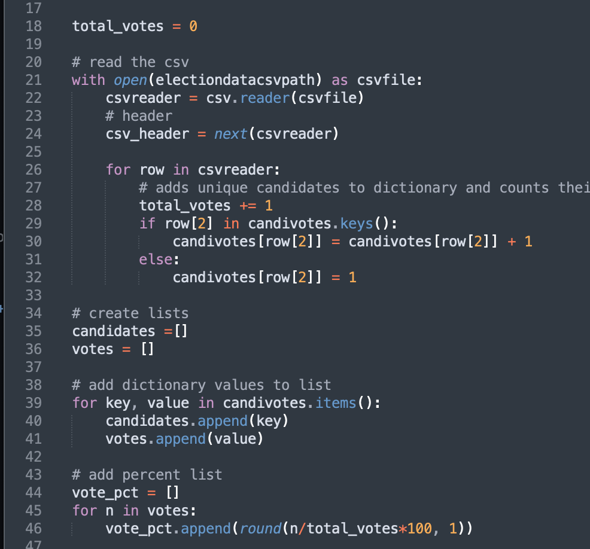
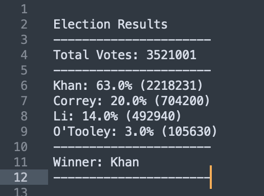

# python_challenge
### "Snakes. Why did it have to be snakes?" - Dr. Henry "Indiana" Jones, Jr.

In this exercise, I wrote Python scripts to loop through two datasets - one the results of a fictional election and the other the ledger of a fictional company - to calculate and extract information. The results are exported to a text file. Take a look at the code in the repo, and below are a few screenshots. 

#### PyPoll

In this exercise, I was given the task of modernizing a fictional small town in rural America. Provided with the election results, I wrote some Python for loops that would loop through the csv, tabulate the election results, including a list of candidates, the number of votes they received, the percentage of votes they receieved, and the winner. The results were printed both to terminal and to a text document.

Some of the Python code.

The election results. Good on you, Khan. Khhhaaaaaaaaaan!

#### PyBank

